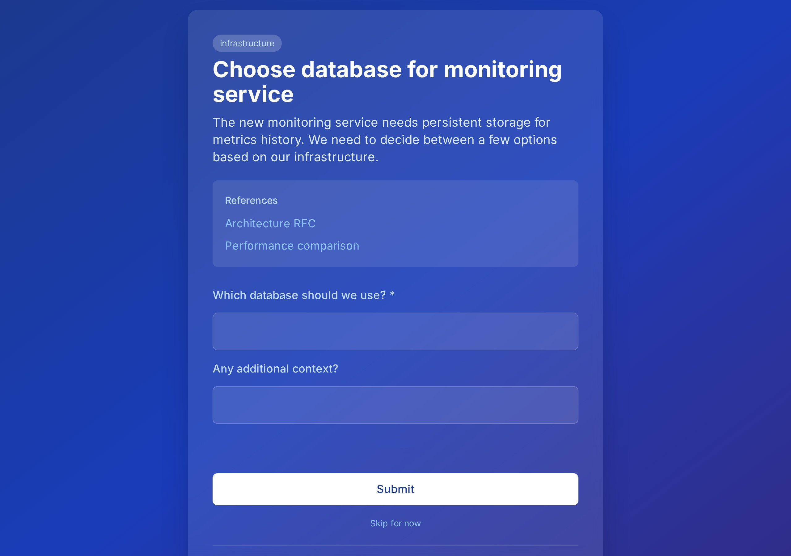

# Neat

**One thing at a time. No friction.**

Neat is an ADHD-friendly, minimal decision UI for humans who work with AI agents. When your AI is faster than you can keep up with, Neat shows you exactly one task at a time with a custom form tailored to what that task needs from you.

<p align="center">
  
</p>

## The Problem

AI agents are becoming incredibly productive — often faster than their humans can keep up with. This creates a new bottleneck: the human's ability to make decisions, provide input, and stay in the loop.

For people with ADHD (or anyone overwhelmed by traditional task management), the cognitive load of:

- Scanning a kanban board
- Deciding what to work on
- Context-switching between unrelated tasks
- Figuring out what a task even needs from them

...is often the blocker, not the work itself.

## The Solution

Neat sits in front of your task management system and:

1. **Presents one task at a time** — no board, no list, just THE thing
2. **Renders custom forms per task** — tailored to what that specific task needs
3. **Minimizes cognitive load** — clear title, summary, question, and input. Nothing else.
4. **Auto-updates your tasks** — responses become comments, status changes automatically
5. **Prioritizes by context** — clusters related tasks to minimize context-switching

## How It Works

```
┌─────────────────────────────────────────────┐
│                                             │
│  [Category Tag]                             │
│                                             │
│  Task Title                                 │
│  ─────────────────────────────────────────  │
│                                             │
│  Brief summary of what this is about and    │
│  why it needs your attention.               │
│                                             │
│  ─────────────────────────────────────────  │
│                                             │
│  **Question:**                              │
│  Which approach should we take?             │
│                                             │
│    ┌─────────┐  ┌─────────┐  ┌─────────┐    │
│    │    A    │  │    B    │  │    C    │    │
│    └─────────┘  └─────────┘  └─────────┘    │
│                                             │
│    ┌─────────────────────────────────┐      │
│    │ Other: [type here]              │      │
│    └─────────────────────────────────┘      │
│                                             │
│              [ Submit ]                     │
│                                             │
└─────────────────────────────────────────────┘
```

### Form Types

| Type      | Use Case                    | UI Component                            |
| --------- | --------------------------- | --------------------------------------- |
| `choice`  | Multiple choice question    | Buttons + "Other" text field            |
| `text`    | Need freeform input         | Text area                               |
| `file`    | Need a file/screenshot      | Drag-and-drop upload zone               |
| `confirm` | Just need acknowledgment    | Single "Done" button                    |
| `steps`   | Human needs to DO something | Step-by-step instructions with checkbox |
| `info`    | FYI, no action needed       | Just a "Got it" button                  |

## Architecture

```
┌──────────────┐      ┌───────────────────────────────────┐
│              │      │               Neat                │
│   AI Agent   │─────▶│  ┌──────────┐   ┌──────────────┐  │
│   (creates   │      │  │ Form DB  │   │  SvelteKit   │  │
│    forms)    │      │  │ (SQLite) │◀─▶│    API       │  │
│              │      │  └──────────┘   └──────────────┘  │
└──────────────┘      │                       │           │
                      │                       ▼           │
┌──────────────┐      │  ┌─────────────────────────────┐  │
│    Human     │─────▶│  │    Neat UI (SvelteKit)      │  │
│  (fills out  │      │  │  - Renders JSON Schema forms│  │
│    forms)    │      │  │  - One task at a time       │  │
└──────────────┘      │  └─────────────────────────────┘  │
                      └────────────────┬──────────────────┘
                                       │
                                       ▼
                             ┌──────────────────┐
                             │   Task Backend   │
                             │  (Fizzy, Linear, │
                             │   GitHub, etc.)  │
                             └──────────────────┘
```

## Design

- **Background:** Deep blue subtle gradient (dark navy to slightly lighter blue)
- **Text:** White, high contrast for readability
- **Typography:** Inter font, large type sizes for easy scanning
- **Style:** Beautiful, minimal — no clutter, generous whitespace, calm aesthetic

## Tech Stack

- **Frontend:** SvelteKit + Tailwind CSS
- **Forms:** JSON Schema with [@sjsf/form](https://github.com/x0k/svelte-jsonschema-form)
- **Database:** SQLite with Drizzle ORM
- **File uploads:** Local storage or S3-compatible

## Getting Started

### Prerequisites

- [Bun](https://bun.sh/) (recommended) or Node.js 22+

### Installation

```bash
# Clone the repo
git clone https://github.com/ndbroadbent/neat.git
cd neat

# Install dependencies
bun install

# Run database migrations
bun run db:migrate

# Start development server
bun run dev
```

### Configuration

Create a `.env` file:

```bash
# Database (SQLite)
DATABASE_URL=file:./data/neat.db

# Fizzy connection
FIZZY_API_URL=https://your-fizzy-instance.example.com
FIZZY_ACCOUNT=1
FIZZY_TOKEN=your-access-token
```

## API

### Forms (for AI agents)

```
POST   /api/forms              # Create form for a task
GET    /api/forms/:id          # Get form
PUT    /api/forms/:id          # Update form
DELETE /api/forms/:id          # Delete form
```

### Queue (for humans)

```
GET    /api/queue              # Get next prioritized form
POST   /api/queue/:id/submit   # Submit form response
POST   /api/queue/:id/skip     # Skip for now
```

### Form Definition Example

```json
{
	"taskId": "task_123",
	"title": "Choose database for new service",
	"summary": "The monitoring service needs persistent storage...",
	"schema": {
		"type": "object",
		"required": ["choice"],
		"properties": {
			"choice": {
				"type": "string",
				"title": "Which database?",
				"enum": ["postgres", "sqlite", "redis"]
			},
			"notes": {
				"type": "string",
				"title": "Any additional context?"
			}
		}
	},
	"uiSchema": {
		"choice": { "ui:widget": "radio" },
		"notes": { "ui:widget": "textarea" }
	}
}
```

## Roadmap

### v0.1 — Core Infrastructure ✅
- [x] SvelteKit project with Tailwind, TypeScript
- [x] Full CI pipeline (lint, typecheck, test, build, Docker)
- [x] SQLite database with Drizzle ORM
- [x] Form CRUD API (`/api/forms/*`)
- [x] JSON Schema form renderer (`@sjsf/form`)
- [x] Queue endpoint with submit flow
- [x] Fizzy integration (comments on submit)
- [ ] **Deploy to K3s** ← *in progress*

### v0.2 — Full Form Experience
- [ ] File upload support with drag-and-drop
- [ ] References display (links, docs, videos)
- [ ] Markdown summary rendering
- [ ] All JSON Schema widgets (select, checkbox, etc.)
- [ ] UI Schema support for custom styling

### v0.3 — Smart Prioritization
- [ ] Context/category tagging on forms
- [ ] Clustering algorithm (same context = consecutive)
- [ ] Priority weighting
- [ ] "Skip for now" with return logic
- [ ] Progress indicator ("3 more in this context")

### v0.4 — Polish
- [ ] Mobile responsive design
- [ ] Keyboard shortcuts (1/2/3 for choices, Enter to submit)
- [ ] Sound/haptic feedback on completion
- [ ] Dark/light mode toggle

### v1.0 — Open Source Release
- [ ] Comprehensive documentation
- [ ] Docker image on GHCR
- [ ] Helm chart for K8s
- [ ] Generic task backend adapters (Linear, GitHub Issues, etc.)

## Philosophy

> "Neat: like whiskey. No mixer, no garnish. Just the thing."

Neat is designed for one purpose: reduce the friction between "AI needs something from you" and "you provide it." No dashboards, no analytics, no gamification. Just the next thing you need to do, presented in the simplest possible way.

## License

MIT

## Contributing

Contributions welcome! Please read the contributing guidelines first.
